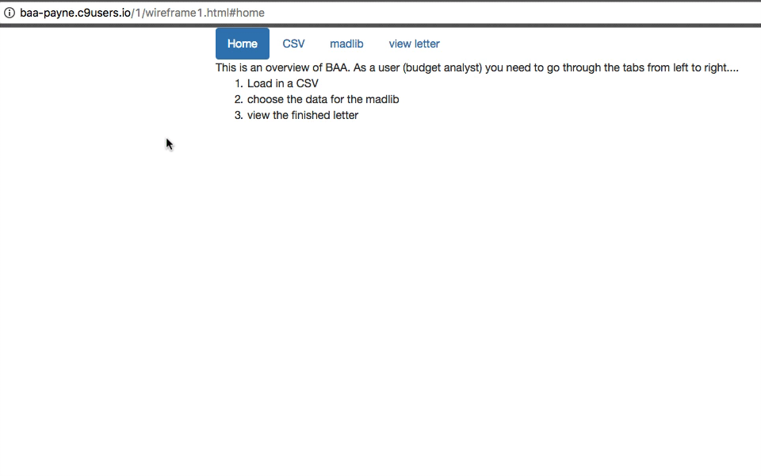

# BAA Exercise 1
1. exercise 1 -- e1 -- create a high level wireframe based on https://codepen.io/wizly/pen/BlKxo/ with four tabs
   1. Home -- gives an overview of using the program
   2. CSV -- Load the CSV into the program
   3. Build madlib -- choose cells from the table and match them to components of the letter
   4. View letter -- view the finished letter.  Suitable for copy & pasting.

The goal is to have your solution look something like the animated gif below.  One can click on tabs to see the different panes.
The conent of the pane does not have to be the same.  Specifically, you don't need all the content on the CSV tab.  That is 
left over from the prototype.   You'll be asked to add in similar content in a future exercise.

When you have your solution working, please make a sub-directory with your solution (use your github login for your subdirectory name).  Then send me a pull request.

