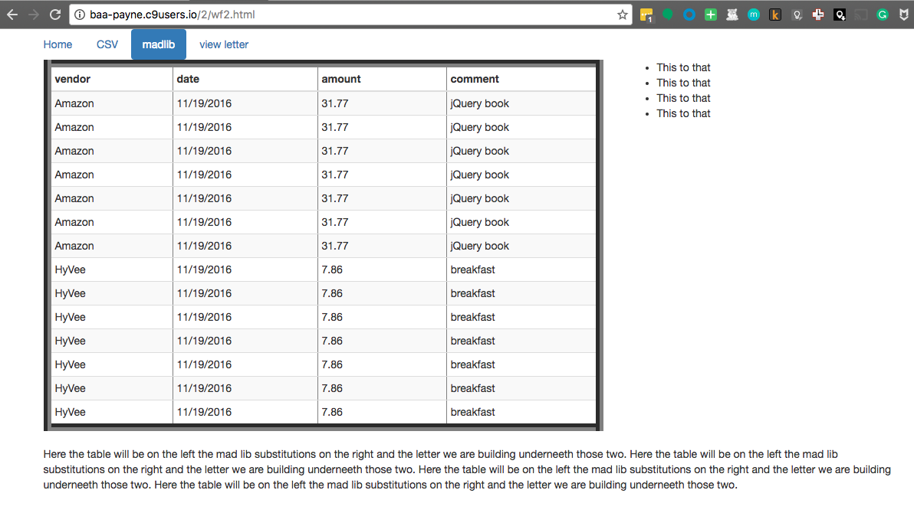

 
The high concept of this exercise is to use bootstrap to achive this affect:

Here is a random reference that helps some.  The bit about how to do a full width column is wrong (at least it was for me).

https://getbootstrap.com/examples/grid/

The file, t.html, is the HTML table you see in the image.
It was extracted using chrome dev tools.

